# 《重返未来：1999》剧情演绎场景 UI 调研报告

## 1. 调研目标

本次调研聚焦手游《重返未来：1999》（Reverse: 1999）的剧情演绎场景 UI，旨在提炼其可借鉴的电影化、复古神秘学设计语言，并映射到当前项目（`d:\BC\qmzz`，紫罗兰永恒花园 Web 应用）的视觉小说/剧情游玩界面，特别是文本显示区域。最终输出 3-5 条带优先级与实现成本的改造建议，为后续视觉升级提供依据。

调研重点收集的素材类型：
- 普通对话场景
- 带选项/交互分支场景
- 角色特写与过场 CG
- 场景转场与标题卡
- 战斗前后剧情衔接

## 2. 参考图

以下图片均已保存至 `./assets/` 目录，引用路径为相对路径。

| 编号 | 图片 | 场景说明 |
|----|----|----|
| 1 | 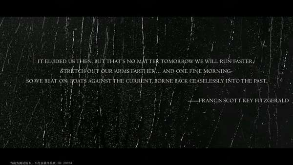 | 章节开场标题卡：黑底雨丝 + 居中英文引言，电影片头感 |
| 2 | 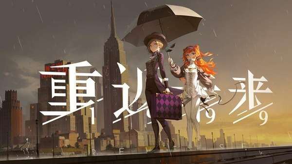 | 主视觉/过场图：角色置于城市天际线，大字号标题覆盖 |
| 3 | 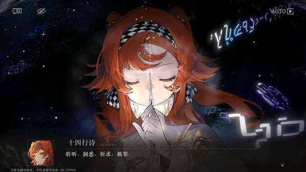 | 普通对话：底部半透明暗色对话框 + 左侧圆形头像 + 说话人名称 |
| 4 | 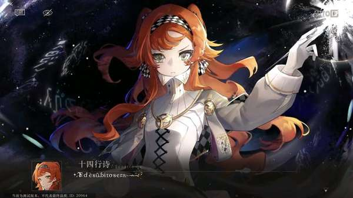 | 特殊文本：咒语以装饰性花体/神秘符号浮于角色前方 |
| 5 | 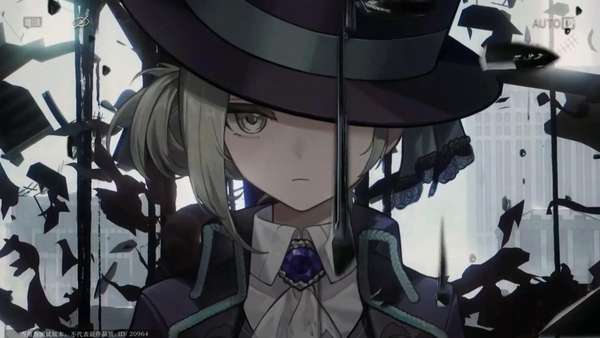 | 角色特写/过场：大比例人物 + 破碎玻璃特效 |
| 6 | 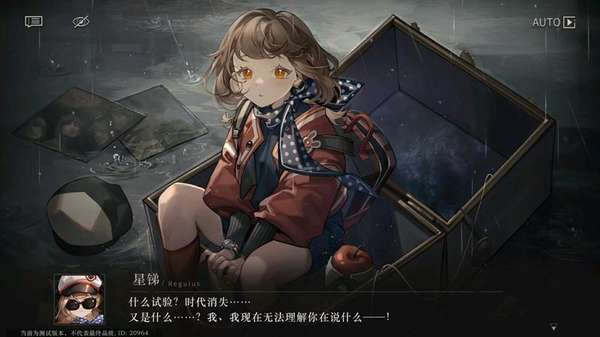 | 场景对话：人物与场景深度融合，底部对话框不遮挡角色表情 |
| 7 | 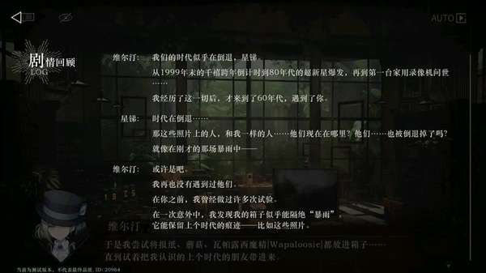 | 剧情回顾面板：左侧 LOG 列表，右侧场景压暗 |
| 8 | 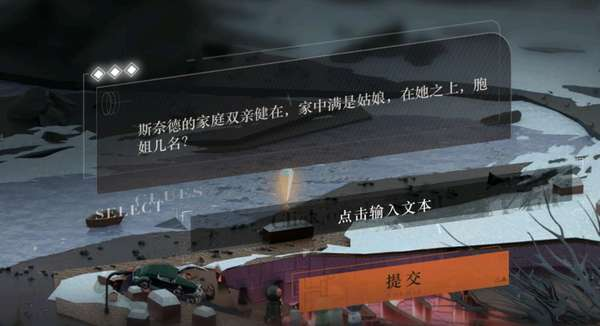 | 交互/选项面板：中央半透明卡片 + 输入框 + 高亮提交按钮 |
| 9 | 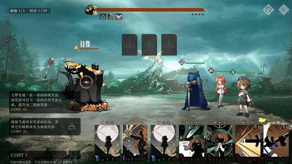 | 战斗前剧情衔接：角色站位与战斗 UI 同屏 |
| 10 | 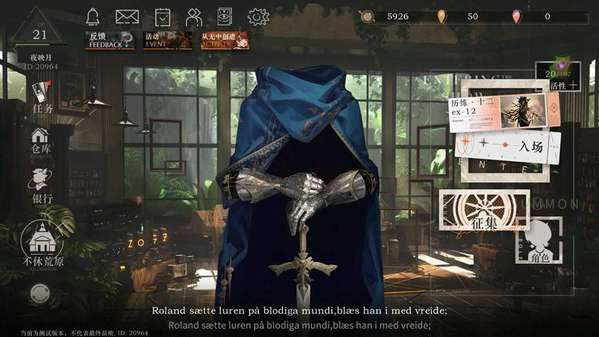 | 战斗后剧情：胜利界面与角色台词叠加 |
| 11 | 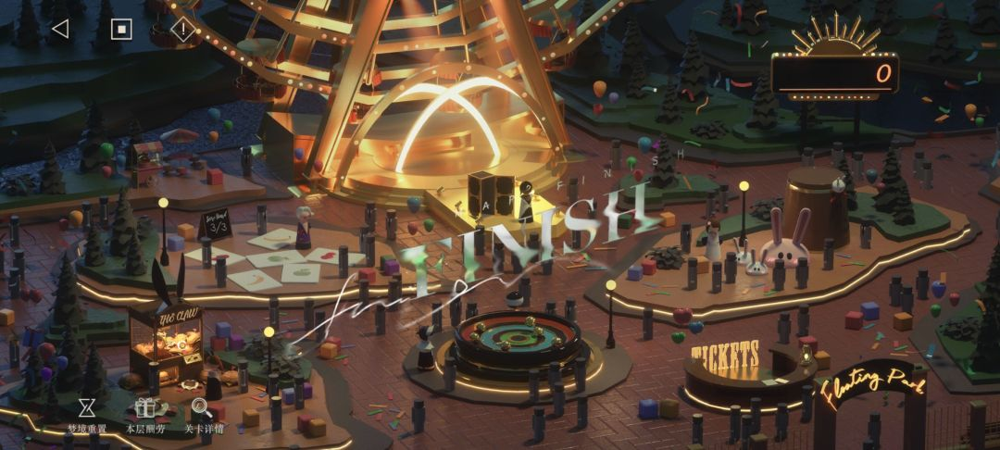 | 地图/场景切换：等距场景 + 大写地点标题 |
| 12 | 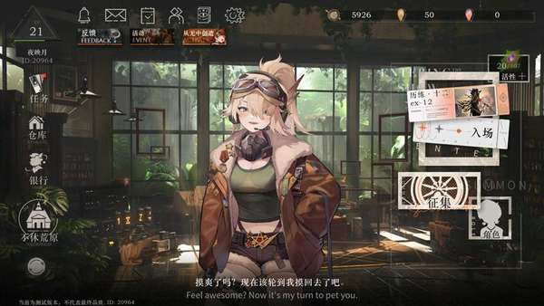 | 主界面看板：底部对话条与角色立绘结合 |

## 3. 模块拆解

### 3.1 对话框形态

- **位置与大小**：固定于屏幕底部，高度约占屏幕 15-22%，宽度全屏或接近全屏，不采用居中浮窗。
- **形态**：深色半透明底栏，边缘平直或仅有极细微圆角，呈现“电影字幕条”感。
- **透明度/毛玻璃**：背景为 `rgba(0,0,0,0.6~0.85)` 的渐变，常叠加轻微高斯模糊与噪点，既保证文字可读，又不完全遮挡场景。
- **边框/投影**：顶部常有一条极细的高光边线或装饰线；底部/身后有柔和投影，使对话框从场景中“浮起”。
- **与屏幕边缘间距**：左右紧贴边缘或仅留 10-20px，垂直方向紧贴安全区底部。

### 3.2 文本排版

- **字体风格**：中文使用偏现代 serif/无衬线混合字体，英文引用或咒语常用手写体、花体、装饰字体，强化神秘学与复古感。
- **字号层级**：
  - 说话人名称：较小（约 13-15px），颜色为金色/浅橙，带轻微发光。
  - 对话正文：较大（约 16-20px），白色或米白，字重中等。
  - 特殊文本（咒语、内心独白）：更大或使用特效字体，常带动态扭曲。
- **行距/字色**：行距约 1.6-1.8；正文高对比白/米色；名称使用品牌金色系。
- **说话人名称样式**：左侧配圆形头像，名称位于头像右侧，带英文小字或角色称号。
- **逐字显示节奏**：默认逐字显现，速度约 40-60ms/字；长按/点击可快进；配合轻微打字音效。

### 3.3 角色立绘布局

- **位置**：人物通常位于画面中下部或中下部偏左/偏右，避免完全居中遮挡对话框。
- **大小比例**：半身/胸像占画面高度 50-75%，过场 CG 可占满全屏。
- **层次关系**：角色立绘 > 前景特效（雨、玻璃碎片、光点）> 背景场景。
- **表情差分**：通过 Live2D/Spine 实现眨眼、口型、微表情；非 Live2D 时通过多张贴图切换。
- **入退场动效**：常见水平滑入（±20-40px）+ 透明度渐变，时长 0.4-0.6s；切换时旧立绘淡出、新立绘淡入，避免生硬跳切。

### 3.4 背景与镜头

- **背景处理**：使用高完成度场景原画或 CG，色调偏暗、低饱和，统一在“暴雨”复古滤镜下。
- **景深**：通过前景遮挡物、背景虚化、粒子（雨、尘埃）营造景深感。
- **暗角/压暗**：四边尤其是顶部和底部使用 radial-gradient 暗角，将视觉焦点压向中央角色与对话框。
- **镜头运动**：背景图在对话间隙有极缓慢的缩放/平移（Ken Burns 效果），过场时配合shake/模糊切换。
- **转场特效**：标题卡使用胶片颗粒 + 雨幕；场景切换使用溶解、擦除或镜头快速推拉。

### 3.5 选项与交互

- **选项数量**：通常为 2-3 个，少数解谜场景为 1 个输入/提交。
- **排列方式**：垂直居中或底部对齐，采用半透明卡片列表；非文字泡式。
- **按钮样式**：长条形卡片，左侧可带小图标或序号，hover/选中时边框高亮、背景变亮。
- **hover/选中态**：颜色从暗半透明过渡到带品牌色（橙/金）边框，文字变白/高亮。
- **与对话框的空间关系**：选项面板通常悬浮于画面上半部或中下部，不与底部对话框重叠；出现选项时背景轻微压暗。

## 4. 当前项目现状与问题

当前项目在 `index.html` 中实现了两套游玩模式：

- **Text 模式**：使用聊天泡泡列表（`.msg-*`），已有较完整的头像、名称、气泡、快捷回复（`.quick-reply-btn`）。
- **Visual 模式**：使用 Galgame 布局（`.galgame-*`），是当前剧情沉浸体验的主界面。

本次重点评估 Visual 模式（相关样式集中在 `index.html` 4250-4700 行与 `styles.css` 10227-10400 行）。

### 4.1 视觉模式对话框现状

```css
.galgame-dialogue-bar {
    position: absolute;
    bottom: 0; left: 0; right: 0;
    z-index: 2;
    padding: 12px 20px 16px;
    background: linear-gradient(to top, rgba(0,0,0,0.85) 0%, rgba(0,0,0,0.6) 70%, transparent 100%);
    backdrop-filter: blur(12px);
    min-height: 35vh; max-height: 35vh;
}
.galgame-dialogue-name { font-size: 14px; color: rgba(100,180,220,0.9); margin-bottom: 6px; }
.galgame-dialogue-text { font-size: 15px; line-height: 1.7; color: rgba(220,225,230,0.95); max-height: 24vh; overflow-y: auto; }
```

### 4.2 主要视觉问题

1. **对话框缺乏“容器感”**
   - 当前是底部全宽渐变条，没有明确边界、圆角、边框或投影，文字容易与背景场景粘连。
2. **缺少说话人头像与层级**
   - 仅有名称与正文，缺少头像、称号、英文名等辅助信息，角色辨识度弱。
3. **文本层级平淡**
   - 名称 14px、正文 15px，字号差距过小；名称颜色偏冷蓝，与金色品牌调性脱节。
4. **背景与镜头处理单一**
   - 背景层默认使用蓝紫渐变，无场景图；切换仅靠透明度淡入，缺少暗角、颗粒、镜头移动。
5. **视觉模式无选项分支 UI**
   - 分支/快捷回复只在 Text 模式以 12px 小胶囊按钮呈现；Visual 模式下玩家无法直观选择。
6. **缺少过场/标题卡**
   - 章节切换、情绪高点没有全屏标题卡或黑场引言，叙事节奏感不足。

## 5. 对比分析

| 维度 | 《重返未来：1999》参考做法 | 当前项目现状 | 差距 |
|----|----|----|----|
| 对话框 | 底部半透明暗色底栏/卡片，带头像、名称、细边框、投影 | 全宽渐变条，无边框，无头像 | 大 |
| 文本排版 | 名称金色小字+头像，正文大白字+阴影，特殊文本有特效 | 名称与正文字号接近，无特效 | 中 |
| 角色立绘 | 大比例半身/胸像，滑入淡出，前景特效 | 左右占位图，切换仅透明度 | 中 |
| 背景镜头 | 场景原画+暗角+颗粒+慢速镜头运动 | 纯色渐变，无动态 | 大 |
| 选项交互 | 中央半透明卡片列表，hover 高亮 | 仅 Text 模式小胶囊按钮 | 大 |
| 转场 | 标题卡、雨幕、溶解、镜头推拉 | 仅淡入淡出 | 中 |

## 6. 改造建议

### 建议 1：重构 Visual 模式对话框为“电影感底栏卡片”

- **优先级**：高
- **当前项目问题**：底部全宽渐变条无边界、无头像，文字可读性与沉浸感不足。
- **1999 参考做法**：使用底部暗色半透明面板，左侧放置圆形角色头像，右侧分上下两行显示“名称/称号”与“正文”，面板顶部加细高光边，底部加柔和投影。
- **预期效果**：对话框从背景中“浮起”，角色身份一目了然，阅读焦点更清晰。
- **实现成本**：中（需调整 `.galgame-dialogue-bar` 结构，增加头像插槽，补充 CSS 边框/投影/渐变，可能需准备默认头像资源）。

### 建议 2：引入电影化背景与镜头处理

- **优先级**：高
- **当前项目问题**：`.galgame-bg-layer` 默认使用蓝紫渐变，无真实场景图，切换只有透明度淡入。
- **1999 参考做法**：全屏场景原画 + 顶部/底部径向暗角 + 轻微颗粒噪点；场景切换时加入慢速缩放/平移或镜头 shake。
- **预期效果**：提升故事氛围与时代感，让每一幕都像电影镜头。
- **实现成本**：中（需扩展背景资源管理，增加 `.galgame-bg-overlay` 的 vignette 与 grain CSS，补充切换动画 keyframes）。

### 建议 3：规范文本层级与特殊文本特效

- **优先级**：中
- **当前项目问题**：名称 14px、正文 15px，对比弱；无咒语/情绪文本特效。
- **1999 参考做法**：名称使用品牌金色、较小字号、轻微 glow；正文使用 17-18px、字距 0.02em、text-shadow；特殊文本（咒语、情绪）使用花体/抖动/放大。
- **预期效果**：强化角色辨识度与情绪表达，避免“一片白字”的单调感。
- **实现成本**：低（纯 CSS 变量调整，配合少量 class 标记特殊文本）。

### 建议 4：为 Visual 模式增加分支选项面板

- **优先级**：中
- **当前项目问题**：Visual 模式下没有选项 UI，分支只能在 Text 模式以小胶囊按钮呈现。
- **1999 参考做法**：在画面中央或中下部弹出 2-3 条半透明长卡片，hover/选中时边框变亮；出现选项时背景轻微压暗。
- **预期效果**：在视觉小说模式下提供沉浸式分支交互，减少模式割裂。
- **实现成本**：中（新增选项渲染容器与选中态样式，处理键盘/触摸/点击事件，与现有对话队列对接）。

### 建议 5：增加章节标题卡与转场仪式

- **优先级**：低
- **当前项目问题**：章节切换、情绪高点缺少全屏标题卡，叙事节奏平淡。
- **1999 参考做法**：黑底/雨幕/颗粒 + 居中引言或章节名，配合 1-1.5s 淡入淡出；战斗前后使用专门衔接画面。
- **预期效果**：章节起点与关键转折更有仪式感，强化“电影化叙事”印象。
- **实现成本**：低（新增全屏 overlay DOM 与 CSS 动画，复用现有背景切换逻辑）。

## 7. 后续行动项

1. **设计稿细化**：基于建议 1-2 输出 Visual 模式对话框与背景的高保真设计稿（含桌面/移动端适配）。
2. **资源准备**：整理默认角色头像、场景背景图、标题卡模板、颗粒噪点纹理。
3. **前端原型**：在本地分支实现建议 1（对话框重构）与建议 3（文本层级），先行验证可读性。
4. **动画补充**：为背景切换、角色入退场、选项面板添加 CSS/JS 动画，参考 1999 的节奏与缓动。
5. **用户测试**：邀请玩家对比 Text 模式与新版 Visual 模式，收集对可读性、沉浸感、交互流畅度的反馈。
6. **迭代选项系统**：在 Visual 模式跑通对话队列后，接入建议 4 的分支选项面板。

---

**报告撰写日期**：2026-07-06  
**报告保存路径**：`d:\BC\qmzz\.trae\specs\research-reverse-1999-story-ui\report.md`  
**参考图目录**：`d:\BC\qmzz\.trae\specs\research-reverse-1999-story-ui\assets\`
